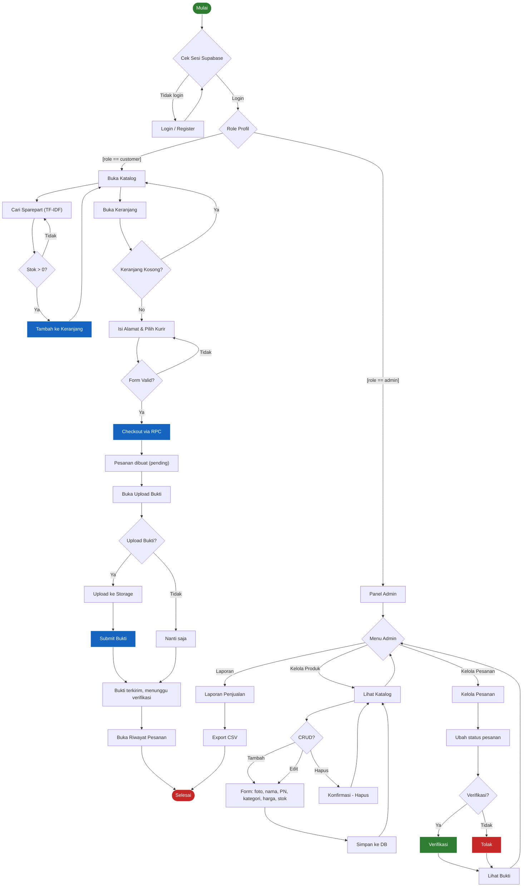

# Activity Diagram — Alur Customer & Admin (Katalog → Checkout → Pembayaran)

> Dibuat untuk tugas Analisis dan Pengujian Sistem

```mermaid
flowchart TD
    Start([Mulai]) --> A1{Cek Sesi Supabase}

    A1 -- Tidak login --> Login[Login / Register]
    Login --> A1

    A1 -- Login --> RoleCheck{Role Profil}
    RoleCheck -- "[role == customer]" --> Catalog[ Buka Katalog ]
    RoleCheck -- "[role == admin]" --> Admin[Panel Admin]

    %% Customer flow
    Catalog --> Search["Cari Sparepart (TF-IDF)"]
    Search --> Add{Stok > 0?}
    Add -- Ya --> AddCart[Tambah ke Keranjang]
    Add -- Tidak --> Search
    AddCart --> Catalog
    Catalog --> CartOpen[Buka Keranjang]

    CartOpen --> CartEmpty{Keranjang Kosong?}
    CartEmpty -- Ya --> Catalog
    CartEmpty -- No --> FillForm[Isi Alamat & Pilih Kurir]
    FillForm --> Validate{Form Valid?}
    Validate -- Tidak --> FillForm
    Validate -- Ya --> Checkout[Checkout via RPC]
    Checkout --> OrderCreated["Pesanan dibuat (pending)"]
    OrderCreated --> PayScreen[ Buka Upload Bukti ]
    PayScreen --> PayChoice{Upload Bukti?}
    PayChoice -- Ya --> Upload[Upload ke Storage]
    Upload --> Submit[Submit Bukti]
    PayChoice -- Tidak --> Later[Nanti saja]
    Submit --> PayDone[Bukti terkirim, menunggu verifikasi]
    Later --> PayDone
    PayDone --> History[Buka Riwayat Pesanan]
    History --> End([Selesai])

    %% Admin flow
    Admin --> AdminMenu{Menu Admin}
    AdminMenu -- "Kelola Produk" --> AdminView[Lihat Katalog]
    AdminView --> AdminAdd{CRUD?}
    AdminAdd -- Tambah --> AdminForm["Form: foto, nama, PN, kategori, harga, stok"]
    AdminAdd -- Edit --> AdminForm
    AdminForm --> AdminSave[Simpan ke DB]
    AdminSave --> AdminView
    AdminAdd -- Hapus --> AdminDelete[Konfirmasi - Hapus]
    AdminDelete --> AdminView
    AdminView --> AdminMenu
    AdminMenu -- "Kelola Pesanan" --> AdminOrders[Kelola Pesanan]
    AdminOrders --> AdminStatus[Ubah status pesanan]
    AdminStatus --> AdminPay{Verifikasi?}
    AdminPay -- Ya --> AdminVerify[Verifikasi]
    AdminPay -- Tidak --> AdminReject[Tolak]
    AdminVerify --> AdminReport[Lihat Bukti]
    AdminReject --> AdminReport
    AdminReport --> AdminMenu
    AdminMenu -- "Laporan" --> AdminLap[Laporan Penjualan]
    AdminLap --> AdminCsv[Export CSV]
    AdminCsv --> End

    style Start fill:#2E7D32,stroke:#fff,color:#fff
    style End fill:#C62828,stroke:#fff,color:#fff
    style AddCart fill:#1565C0,stroke:#fff,color:#fff
    style Checkout fill:#1565C0,stroke:#fff,color:#fff
    style Submit fill:#1565C0,stroke:#fff,color:#fff
    style AdminVerify fill:#2E7D32,stroke:#fff,color:#fff
    style AdminReject fill:#C62828,stroke:#fff,color:#fff
```