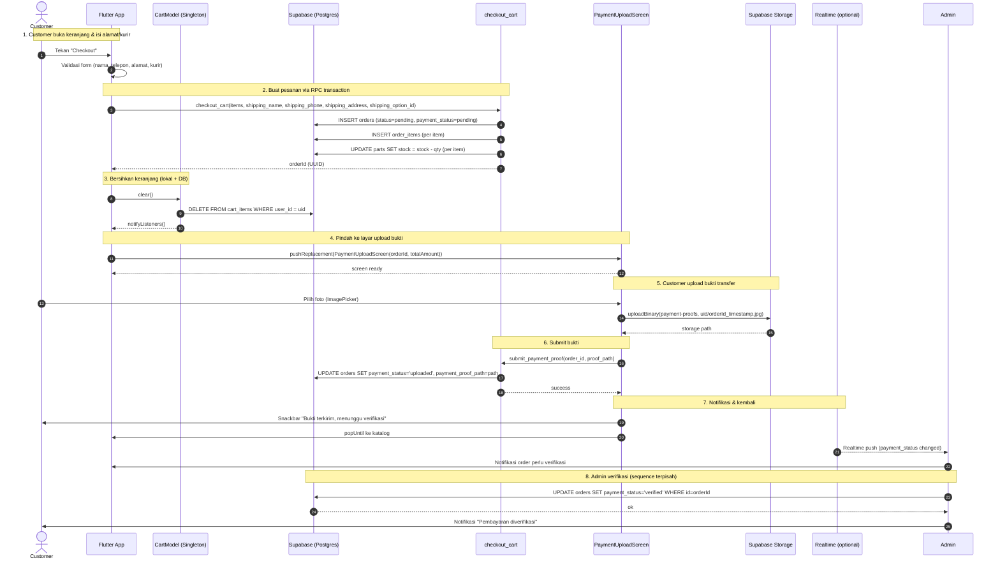

# Sequence Diagram — Alur Checkout Customer

> Dibuat untuk tugas Analisis dan Pengujian Sistem

```mermaid
sequenceDiagram
    autonumber
    actor Customer as Customer
    participant App as Flutter App
    participant Cart as CartModel (Singleton)
    participant DB as Supabase (Postgres)
    participant RPC as checkout_cart
    participant Pay as PaymentUploadScreen
    participant Storage as Supabase Storage
    participant Realtime as Realtime (optional)

    Note over Customer,App: 1. Customer buka keranjang & isi alamat/kurir
    Customer->>App: Tekan "Checkout"
    App->>App: Validasi form (nama, telepon, alamat, kurir)

    Note over App,RPC: 2. Buat pesanan via RPC transaction
    App->>RPC: checkout_cart(items, shipping_name, shipping_phone, shipping_address, shipping_option_id)
    RPC->>DB: INSERT orders (status=pending, payment_status=pending)
    RPC->>DB: INSERT order_items (per item)
    RPC->>DB: UPDATE parts SET stock = stock - qty (per item)
    RPC-->>App: orderId (UUID)

    Note over App,Cart: 3. Bersihkan keranjang (lokal + DB)
    App->>Cart: clear()
    Cart->>DB: DELETE FROM cart_items WHERE user_id = uid
    Cart-->>App: notifyListeners()

    Note over App,Pay: 4. Pindah ke layar upload bukti
    App->>Pay: pushReplacement(PaymentUploadScreen(orderId, totalAmount))
    Pay-->>App: screen ready

    Note over Pay,Storage: 5. Customer upload bukti transfer
    Customer->>Pay: Pilih foto (ImagePicker)
    Pay->>Storage: uploadBinary(payment-proofs, uid/orderId_timestamp.jpg)
    Storage-->>Pay: storage path

    Note over Pay,RPC: 6. Submit bukti
    Pay->>RPC: submit_payment_proof(order_id, proof_path)
    RPC->>DB: UPDATE orders SET payment_status='uploaded', payment_proof_path=path
    RPC-->>Pay: success

    Note over Pay,Realtime: 7. Notifikasi & kembali
    Pay->>Customer: Snackbar "Bukti terkirim, menunggu verifikasi"
    Pay->>App: popUntil ke katalog
    Realtime-->>Admin: Realtime push (payment_status changed)
    Admin->>App: Notifikasi order perlu verifikasi

    Note over Admin,DB: 8. Admin verifikasi (sequence terpisah)
    Admin->>DB: UPDATE orders SET payment_status='verified' WHERE id=orderId
    DB-->>Admin: ok
    Admin->>Customer: Notifikasi "Pembayaran diverifikasi"
```