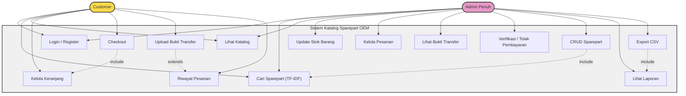

# Use Case Diagram — Onderdil Motor Indonesia

> Dibuat untuk tugas Analisis dan Pengujian Sistem

```mermaid
flowchart TD
    %% Actors
    Customer([Customer])
    Admin([Admin Penuh])

    %% System boundary
    subgraph System["Sistem Katalog Sparepart OEM"]
        direction TB

        UC1["Login / Register"]
        UC2["Cari Sparepart (TF-IDF)"]
        UC3["Lihat Katalog"]
        UC4["Kelola Keranjang"]
        UC5["Checkout"]
        UC6["Upload Bukti Transfer"]
        UC7["Riwayat Pesanan"]
        UC8["Update Stok Barang"]
        UC9["Kelola Pesanan"]
        UC10["Lihat Bukti Transfer"]
        UC11["Verifikasi / Tolak Pembayaran"]
        UC12["CRUD Sparepart"]
        UC13["Lihat Laporan"]
        UC14["Export CSV"]
    end

    %% Customer
    Customer --> UC1
    Customer --> UC2
    Customer --> UC3
    Customer --> UC4
    Customer --> UC5
    Customer --> UC6
    Customer --> UC7

    %% Admin
    Admin --> UC1
    Admin --> UC2
    Admin --> UC3
    Admin --> UC8
    Admin --> UC9
    Admin --> UC10
    Admin --> UC11
    Admin --> UC12
    Admin --> UC13
    Admin --> UC14

    %% Include relationships
    UC5 -.->|include| UC4
    UC6 -.->|extends| UC7
    UC12 -.->|include| UC2
    UC14 -.->|include| UC13

    %% Style
    style Customer fill:#f9d949,stroke:#333,stroke-width:2px
    style Admin fill:#e699c7,stroke:#333,stroke-width:2px
    style System fill:#f0f0f0,stroke:#333,stroke-width:2px
```